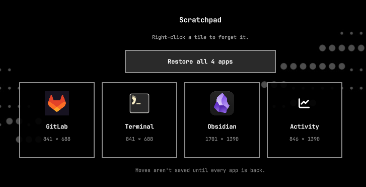

# Scratchpad placeholders

Remember Omarchy scratchpad apps across reboots and restore them as clickable
placeholders.

Anything you put on the scratchpad is remembered automatically. Move or
resize those windows and the saved layout updates with them. Close an app or
reboot, then open the scratchpad (`Super + S`) — a tile stands in for each
missing app. **Restore all** brings the whole arrangement back in one click;
left-click a single tile to relaunch just that app in its last size and
position. Right-click forgets it.

This is not a notes pad and not a bar occupancy indicator. It restores the
apps you actually kept on the Hyprland scratchpad.



## How it remembers

No snapshot command. The plugin watches `special:scratchpad`:

- **New window** — sending an app to the scratchpad (`Super + Alt + S`) adds
  it to the remembered set: name, launch command, icon, size, and position.
  It is floated as it arrives, because Hyprland otherwise tiles it in at full
  size underneath the windows already there, leaving no edge to grab.
- **A program running in a terminal** — a terminal with something running in
  it is remembered as that program, not as a bare shell, and comes back
  through the matching Omarchy launcher. Leave `cliamp` playing and the tile
  says cliamp; restore it and cliamp is playing again. Only names that are a
  plain lowercase command on `PATH` are used, so what gets remembered is the
  same `omarchy-launch-tui` form the plugin already trusts.
- **More than one of the same app** — two terminals kept on the scratchpad are
  remembered as two slots, each with its own rectangle, and restore to their
  own places rather than on top of each other. Identical windows are matched
  to slots by whichever saved rectangle is nearest, since nothing about a
  window survives a reboot to tell two of them apart.
- **Layout changes** — while the app is still on the scratchpad, moving,
  resizing, or floating it updates the saved geometry. The next restore uses
  whatever you left it as, not the first size you happened to use.
- **Only while the set is whole** — geometry is recorded only when every
  remembered app is actually on the scratchpad. Tiled windows reflow the
  moment a neighbour leaves, and logging out closes them one at a time, so
  tracking that reflow would overwrite the layout with the shape the pad
  collapsed into on the way down. Rearranging with a tile still missing is
  therefore not saved. The overlay names the apps that are missing while
  tracking is paused, so restore them first or dismiss the tiles you no
  longer want with the × in their corner.
- **Apps that cannot be restarted** — only apps matched to a desktop entry or
  a known Omarchy launcher can be relaunched, so a tile the plugin has no
  trusted command for says `Can't be started` rather than doing nothing when
  clicked. It will never fill its own slot, so it holds tracking paused until
  it is dismissed — which is left to you rather than decided for you.
- **Monitors** — a special workspace only ever lives on one monitor, so
  remembered rectangles are translated onto whichever monitor the scratchpad
  opens on and kept inside it. Unplug the screen a layout was saved on, or
  restore onto a smaller one, and the windows are moved and shrunk to fit
  rather than placed off the edge of the desk where nothing can reach them.
- **Closed or after reboot** — if the app is gone, opening the scratchpad
  shows a placeholder tile instead of an empty drop-down.
- **Out of sight** — a window cannot move itself, but anything running as you
  can ask Hyprland to move it, so a scratchpad window can be parked off the
  edge of the desk or shrunk to a sliver and keep running unseen. Those are
  named when you open the scratchpad, with one click to bring them back, and
  where a window went to hide is never recorded as the place to restore it
  to. The scratchpad opens to say so even when nothing is missing.
- **Moved off the scratchpad** — sending the live window to a normal
  workspace forgets it. The scratchpad is only for what you keep there.
- **Restore** — **Restore all** relaunches every missing app, one at a
  time so each lands under its own window rule. Left-click a single tile to
  bring back just that app. Either way the whole pad is snapped back onto its
  remembered geometry. Restored windows are floated, since
  that is the only way to guarantee the exact rectangle. Right-click removes
  the tile.
  Only apps matched to a desktop entry or a known Omarchy launcher can be
  restarted; a raw window class is never used as a command. A window names
  its own class, so where a class does select a launcher the target must be a
  binary this account cannot replace — a window cannot point a tile at
  something dropped in a writable part of `PATH`.

Requires **Omarchy 4** (Quattro) and Python 3. The helper uses only the
standard library plus `hyprctl`.

## Install

```sh
omarchy plugin add https://github.com/imcmurray/omarchy-scratchpad-placeholders.git --enable
```

From a local checkout:

```sh
omarchy plugin add /home/ianm/Development/omarchy-scratchpad-placeholders --enable
```

Then rescan if the overlay does not appear:

```sh
omarchy-shell shell rescanPlugins
omarchy plugin list | grep ianm.scratchpad
```

## Usage

| Action | How |
| --- | --- |
| Toggle the scratchpad | `Super + S` |
| Send the focused window to the scratchpad | `Super + Alt + S` |
| Bring the whole scratchpad back | **Restore all** |
| Relaunch one remembered app | Left-click its tile |
| Forget a remembered app | Right-click its tile |

Remembered apps are stored in `~/.config/omarchy/scratchpad.json`. Tracker
state lives in `~/.local/state/omarchy/scratchpad-tracker.json`. The plugin
does not rewrite Hyprland config or other user files.

## Remove

```sh
omarchy plugin remove ianm.scratchpad
```

Optional cleanup of remembered apps:

```sh
rm -f ~/.config/omarchy/scratchpad.json
rm -f ~/.local/state/omarchy/scratchpad-tracker.json
```

## Develop

```sh
omarchy plugin validate .
python3 test_layout.py
```

`test_layout.py` runs against fake `hyprctl` data — it needs neither a live
Hyprland nor the files under `~/.config`.

The overlay entry point is `Main.qml`. Layout tracking and launch live in
`layout.py`.

## License

MIT
